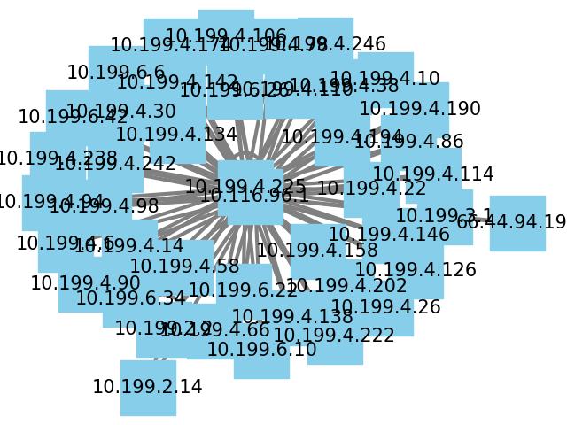

# Building Network Topology

## Chemistry Building Network Topology

 Updated the topology image to showcase the clear and clean graph 

The connection below looks messy but it is indeed because of the multiple routers, As when the number of datas were reduced it was easy to figure out which topolgy it followed.

Network topology of chemistry building with fewer datas.

